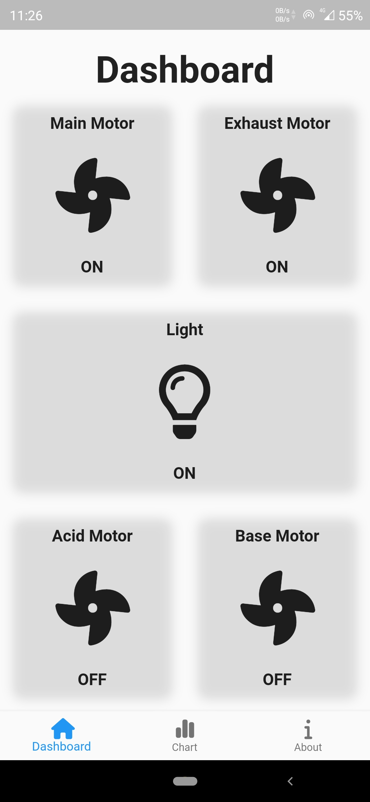
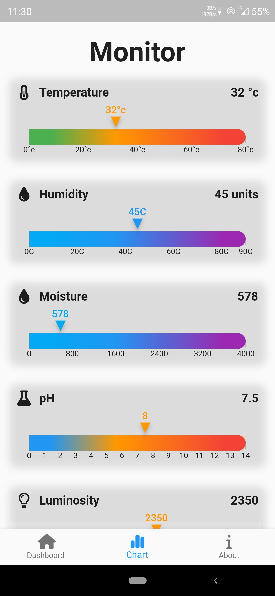
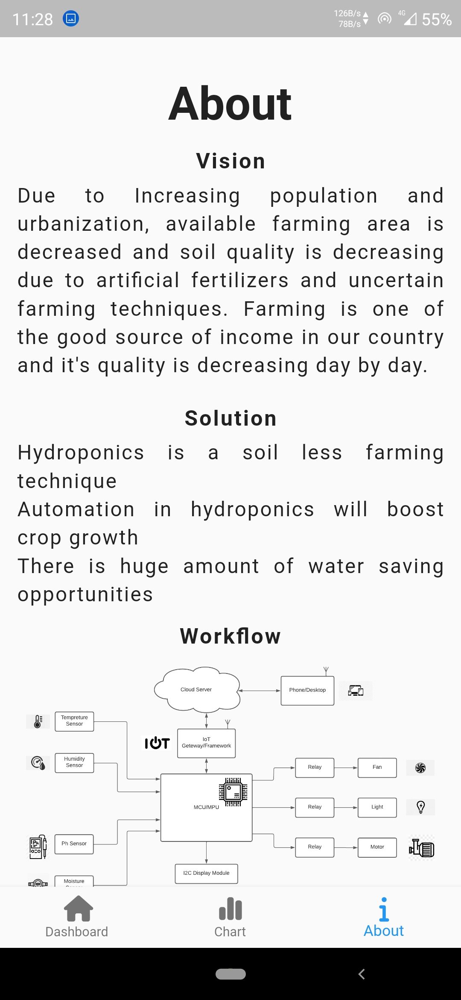

# hydroponics_app

## App Demo

| | | |
|:---:|:---:|:---:|
|  |  |  |

## MVC(Model View Controller) Design Pattern 
- The Model contains the pure application data
- The View presents the model’s data to the user. The view knows how to access
  the model’s data, but it does not know what this data means or what the user
  can do to manipulate it.
- The Controller exists between the view and the model. It listens to events
  triggered by the view (or another external source) and executes the
  appropriate reaction to these events. In most cases, the reaction is to call
  a method on the model. Since the view and the model are connected through a
  notification mechanism, the result of this action is then automatically
  reflected in the view.

## Made By:
- [Rishav Singh](https://github.com/rishav-singh-0)
- [Kashyap Joshi](https://github.com/kashyap-21)
